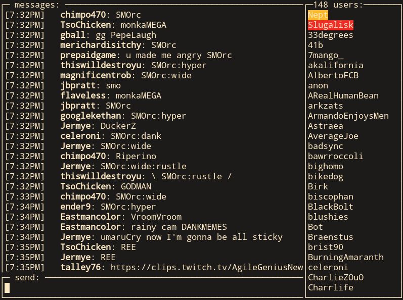

# mvext

A fork of [tsgg](https://github.com/strims/tsgg), the terminal client for Strims.gg.

This fork targets my current chat stack and is built around the **v2 chat deployment**, which uses the **Go backend** rather than the older Node.js backend.

> This is a fork of `tsgg` and requires a deployed **v2 chat** stack using the **Go backend**. It does not target the older Node.js chat backend.

## Compatibility

This project expects:

- **v2 chat** to be deployed
- the **Go chat backend** to be running

It is **not** aimed at older deployments, and current live chat backend that still use the legacy Node.js backend, and compatibility with those setups is not guaranteed.

## Notes

The codebase began as `tsgg` and has been adjusted to fit my own infrastructure and workflow.

# tsgg
sgg chat in the terminal

`cp sample-config.toml config.toml`
`go build`
